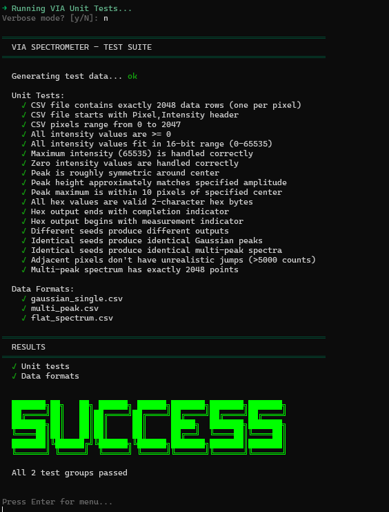
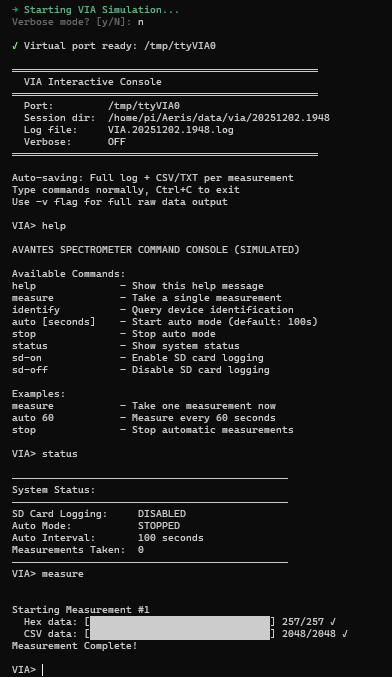
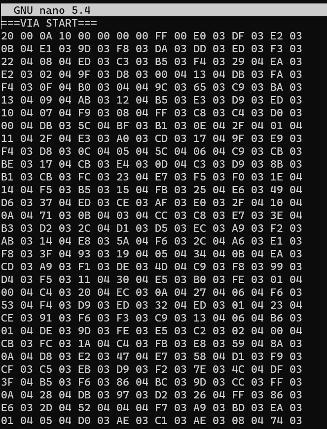

# AERIS / Via Software

## Brief Overview

This is the code repository for the VIA (Variability In Atmosphere) Payload firmware for the AERIS mission. VIA is one of three scientific payloads creating the **first-ever trimodal, temporally-linked dataset** examining upper atmospheric composition (NOx, O3) before, during, and after solar particle events.

**AERIS Payload Architecture:**

- **VIA** (spectrometer) - Takes snapshots, triggers GPIO to coordinate other payloads
- **SEEs** (particle detector) - Continuous recording, ±2.5s window on VIA trigger
- **AMPPs** (plasma detector) - Continuous recording, ±2.5s window on VIA trigger

**Temporal Linking (The Key):**

VIA controls timing. When VIA captures a spectrum, it pulses GPIO → SEEs and AMPPs capture synchronized ±2.5s windows → All three datasets bundled with VIA's timestamp → OBC packages for downlink.

**Why This Matters:** SEEs and AMPPs don't track absolute time - they only count "1 second, 1 second, 1 second." The ±2.5s buffer captures what happened BEFORE the VIA trigger (pre-event conditions), DURING (the event itself), and AFTER (post-event response). This creates temporally-linked trimodal measurements before, during, and after solar particle events.

VIA payload uses an Avantes AvaSpec-Mini2048CL spectrometer connected to Teensy 4.1 microcontroller acting as a USB host.

The firmware handles:
- USB communication with the AvaSpec spectrometer using the [USBHost_t36](https://github.com/PaulStoffregen/USBHost_t36) library by Paul Stoffregen
- Measurement data collection (4096 bytes / 2048 pixels)
- SD card logging for data backup
- Command console interface via USB Serial
- GPIO trigger output (future) to synchronize SEEs and AMPPs payloads

## System Architecture

```
AvaSpec Spectrometer (USB)
         ↓
Teensy 4.1 (VIA Payload)
    ├─ SD Card (local logging)
    ├─ USB Serial (command console)
    └─ Future: UART (Serial1) → Artemis OBC (RPi) → RFM23 Radio
```

**Current Version:** V3.0 - Command Console Mode

## Key Libraries

| Library | Purpose |
|---------|---------|
| [USBHost_t36](https://github.com/PaulStoffregen/USBHost_t36) | Paul Stoffregen's USB Host library for Teensy - enables direct USB communication with the AvaSpec spectrometer |
| [SdFat](https://github.com/greiman/SdFat) | High-performance SD card library for data logging |
| [pyserial](https://pypi.org/project/pyserial/) | Python serial communication for the interactive console |
| [pty](https://docs.python.org/3/library/pty.html) | Unix pseudo-terminal for virtual serial port simulation |

## Quick Start

**👉 See [QUICKSTART.md](QUICKSTART.md) for complete workflow**

### On the Pi 400

```bash
ssh aeris@192.168.120.22
aeris
```

That's it! The AERIS console handles everything - pick from the menu:

- **1** - VIA Unit Tests
- **2** - VIA Simulation (no hardware needed)
- **3** - VIA HIL Test (real Teensy)

Or use CLI shortcuts:

```bash
aeris via test      # Run unit tests
aeris via sim       # Run simulation
aeris via sim -v    # Simulation with verbose output
```


### Local Development

```bash
# Build and upload firmware
cd AvaSpecDriver
pio run --target upload

# Run console
./VIA.sh
```

## AvaSpec Software Build Instructions
1. Download and install VSCode & GitHub Desktop.
* VSCode: https://code.visualstudio.com/download
* GitHub Desktop: https://desktop.github.com/download/
2. Install both the C/C++ and PlatformIO extension in VSCode.
* PlatformIO: https://platformio.org/install/ide?install=vscode
* C/C++: https://code.visualstudio.com/docs/languages/cpp
3. Clone the repository from GitHub Desktop by clicking "Add" at the top left, "Clone Repository...", "URL," copying the link below into the prompt, and then clicking Clone.
* Repository URL: https://github.com/hsfl/aeris-via-software.git
4. Go to VSCode and initialize the PlatformIO extension.
5. In the "QUICK ACCESS" column, click on "Open" and then "Open Project" in the tab that opens. Locate and choose the "AvaSpecDriver" folder within the "aeris-via-software" folder.
* This should have opened the AvaSpecDriver folder as a PlatformIO project with all the dependencies and configurations it needs.
6. From the explorer column on the left, navigate the AvaSpecDriver folder to "src", then to "main.cpp".
7. On the bottom left are multiple buttons; click the checkmark to build the code, confirming a successful build when [SUCCESS] appears on the terminal that pops up.
* That finishes building the software.

To get relevant data, continue to "Getting Data" section.

## Getting Data with Teensy 4.1

### Hardware Connections
1. **AvaSpec Spectrometer**: Connect to Teensy 4.1 via USB host port (spliced cable)
2. **SD Card**: Insert into Teensy 4.1 built-in SD card slot
3. **USB Serial**: Connect micro-USB to computer for command console
4. **Power**: Provide 5V power to Teensy 4.1

### USB Host Wiring
The AvaSpec USB cable is spliced and connected to Teensy USB Host pads:
- 🟥 Red (5V) → Teensy 5V Host Pad
- 🟩 Green (D+) → Teensy D+ Host Pad
- ⬜ White (D–) → Teensy D– Host Pad
- ⬛ Black (GND) → Teensy GND Host Pad

D+/D– twisted pair maintained for signal integrity.

### Data Flow
The firmware provides an interactive command console:
1. User sends commands via USB Serial (e.g., `measure`, `auto 60`)
2. System collects full spectrum measurement (2048 pixels)
3. Data logged to SD card in two formats:
   - Raw hex dump: `/meas_XXXX.txt` (~12,355 bytes)
   - CSV format: `/spectrum_XXXX.csv` (Pixel,Intensity)
4. CSV data also output via USB Serial for live capture

### Data Output Formats
- **Binary**: 4,106 bytes (10-byte header + 4,096 bytes pixel data)
- **ASCII hex**: ~12,355 bytes on SD card (`/meas_XXXX.txt`)
- **CSV**: Pixel,Intensity format on SD card (`/spectrum_XXXX.csv`) and USB Serial
- **Future optimization**: Raw binary transmission (67% size reduction)


## Firmware Modules

### Core Modules
- **main.cpp**: Command console and measurement sequencing
- **AvaSpec.h/.cpp**: USB Host driver for AvaSpec spectrometer (commands 0x05, 0x06, 0x0F, 0x13, 0xC0)
- **Logger.h/.cpp**: SD card logging utility for measurements and telemetry
- **OBCBridge.h/.cpp**: Optional UART bridge module (future use)

### Hardware Configuration
- **USB Host**: AvaSpec spectrometer connection (spliced cable)
- **Serial (USB)**: Command console and debug output at 115200 baud
- **Serial1 (UART)**: Optional OBC bridge at 115200 baud (TX=1, RX=0)
- **SD Card**: Built-in Teensy 4.1 SD interface (BUILTIN_SDCARD)

## Testing

### Automated Test Suite

The `tests/` directory contains a complete test suite for development without hardware:

- **test_data_generator.py**: Generates realistic spectrum data
- **test_python_scripts.py**: 10+ unit tests for data processing
- **virtual_serial_port.py**: Simulates Teensy firmware for interactive testing
- **run_all_tests.sh**: Automated test runner

Run all tests:

```bash
cd tests
./run_all_tests.sh
```

See [tests/README.md](tests/README.md) for details.

### Test Libraries & Dependencies

The test suite uses Python standard library only (no external dependencies required):

| Library | Purpose |
|---------|---------|
| `unittest` | Test framework and assertions |
| `csv` | Reading/writing spectrum CSV files |
| `struct` | Binary data packing/unpacking |
| `pty` + `os` | Virtual serial port creation (Linux/Mac) |
| `threading` | Concurrent virtual serial port handling |
| `subprocess` | Running test scripts |
| `pathlib` | Cross-platform file path handling |
| `datetime` | Timestamped session folders |

No `pip install` required - works on any system with Python 3.6+.

### Test Without Hardware

Simulate the full system locally:

```bash
aeris via sim       # Runs virtual serial port + console automatically
```

Or manually:

```bash
cd tests && python3 virtual_serial_port.py &
./VIA.sh /tmp/ttyVIA0
```

## Pi 400 Remote Testing

A dedicated Raspberry Pi 400 serves as the remote testing machine for both VIA and SEEs payloads.

### Connect and Run

```bash
ssh aeris@192.168.120.22
aeris
```

The AERIS console provides:

- **1) Unit Tests** - Automated Python test suite
- **2) Simulation** - Virtual serial port with fake data
- **3) HIL Test** - Real Teensy hardware
- **7) Update Code** - Pull latest from git
- **8) Flash VIA** - Upload firmware to Teensy

### CLI Shortcuts

```bash
aeris via test      # Run unit tests
aeris via sim       # Run simulation
aeris via sim -v    # Verbose mode
aeris update        # Pull latest code
aeris help          # Show all commands
```

### Remote Access

| Method | Command |
|--------|---------|
| **SSH** (same network) | `ssh aeris@192.168.120.22` |
| **Tailscale** (remote) | `ssh aeris@<tailscale-ip>` |

### Unit Tests



### Simulation Mode



### Measurement Data



## Getting Data with AvaSoft
* Install AvaSoft software https://www.avantes.com/products/software/avasoft/
* Connect the VIA USB port directly to the PC
* Start collecting data and zoom in


## Development Roadmap

### Version History
- **V1.0**: ✅ Standalone testing - USB to spectrometer, SD card logging
- **V2.0**: ✅ UART bridge to OBC (deprecated in V3.0)
- **V3.0**: ✅ Command console mode - Interactive control, dual CSV output
- **V4.0**: 🔄 Full system (AERIS iOBC) - Merge into AERIS FSW, EPS/ADCS integration

### Critical Path
- [x] Create Initial Driver
- [x] Validate Teensy and Spectrometer USB Ports can connect
- [x] Attempt Identification Command & Response to validate communication
- [x] Attempt Measurement Commands and read the "Unsolicitated" data messages
- [x] Read all 10 + 4096 bytes of data from a full measurement
- [x] Graph data by sending to computer Serial Port and graphing through MATLAB
- [x] Write data into SD Card storage
- [x] Implement command console interface (V3.0)
- [x] Dual CSV output (Serial + SD)
- [x] Python data capture utilities
- [ ] Optimize for binary data transmission (67% size reduction)
- [ ] Define Payload-to-Bus Software ICD fields for packetized CSV transmission
- [ ] Add command handlers for remote "Start/Stop/Config" through spacecraft command bus
- [ ] Integrate RPI connection code on Artemis OBC side
- [ ] Interface into flat-sat testing environment
- [ ] Full integration with Artemis spacecraft bus software

---

## Repository

**GitHub**: https://github.com/hsfl/aeris-via-software

**License**: MIT (see LICENSE file)

---

## Credits

**AERIS Payload Software Team** - Hawaii Space Flight Laboratory

*2025*
