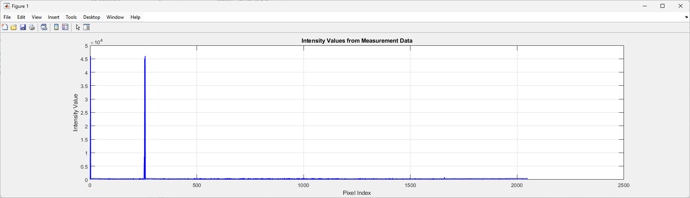

# AERIS VIA Payload Software

**VIA** - Variability In Atmosphere

Firmware for the VIA payload on the AERIS mission. Controls an Avantes AvaSpec-Mini2048CL spectrometer via Teensy 4.1 microcontroller acting as USB host.

---

## Quick Start

**👉 See [QUICKSTART.md](QUICKSTART.md) for detailed usage instructions**

```bash
# Build and upload
cd AvaSpecDriver
pio run --target upload

# Connect to console
screen /dev/ttyACM0 115200

# Take measurement
VIA> measure
```

---

## System Overview

### Hardware
- **Teensy 4.1** - Main microcontroller (USB Host + SD card)
- **AvaSpec-Mini2048CL** - Spectrometer (2048 pixels, USB 2.0)
- **SD Card** - Local data logging
- **USB Serial** - Command console and data output

### Architecture

```
AvaSpec Spectrometer (USB Host)
         ↓
    Teensy 4.1
    ├─ SD Card (local logging)
    ├─ USB Serial (command console)
    └─ Future: UART → Artemis OBC → Radio
```

### Firmware Capabilities
- Interactive command console via USB Serial
- USB Host communication with AvaSpec spectrometer
- Full spectrum measurements (2048 pixels × 16-bit)
- Dual output: USB Serial + SD card logging
- Real-time pixel value display during acquisition
- Automatic measurement mode with configurable intervals
- Python utilities for data capture and file transfer

---

## Project Structure

```
aeris-via-software/
├── README.md                      # This file
├── AvaSpecDriver/                 # Main firmware project
│   ├── QUICKSTART.md              # Usage guide (START HERE)
│   ├── platformio.ini             # Build configuration
│   ├── src/
│   │   ├── main.cpp               # Command console
│   │   ├── AvaSpec.h/.cpp         # Spectrometer driver
│   │   ├── Logger.h/.cpp          # SD card logging
│   │   └── OBCBridge.h/.cpp       # Optional UART bridge
│   ├── capture_measurement.py     # Live data capture
│   ├── file_transfer.py           # SD card file download
│   └── ...
└── Example_Pixel_Spectrum.png     # Example output
```

---

## Development Setup

### Prerequisites

1. **VSCode** - https://code.visualstudio.com/download
2. **PlatformIO** - https://platformio.org/install/ide?install=vscode
3. **C/C++ Extension** - https://code.visualstudio.com/docs/languages/cpp

### Clone and Build

```bash
# Clone repository
git clone https://github.com/hsfl/aeris-via-software.git
cd aeris-via-software/AvaSpecDriver

# Build
pio run

# Upload to Teensy
pio run --target upload
```

---

## Current Version: V3.0

**Command Console Mode** - Interactive spectrometer control

### Features
- ✅ USB Host driver for AvaSpec-Mini2048CL
- ✅ Interactive command console (help, measure, auto, status, etc.)
- ✅ SD card logging (CSV + hex dump)
- ✅ Real-time pixel data display
- ✅ Dual CSV output (Serial + SD)
- ✅ Python data capture utilities
- ✅ File transfer from SD card

### Data Output
- **Binary**: 4,106 bytes (10-byte header + 4,096 bytes pixels)
- **ASCII hex**: ~12,355 bytes (for SD logging)
- **CSV**: Pixel,Intensity format

---

## Version History

- **V1.0** (Complete) - Standalone USB driver, SD logging
- **V2.0** (Complete) - UART bridge to OBC (deprecated in V3.0)
- **V3.0** (Current) - Command console mode
- **V4.0** (Future) - Integration with AERIS flight software

---

## Development Roadmap

### Completed
- [x] USB Host driver for AvaSpec
- [x] Full 4106-byte measurement readout
- [x] SD card logging
- [x] Command console interface
- [x] Dual CSV output
- [x] Python utilities

### Future
- [ ] Optimize for binary data transmission (67% size reduction)
- [ ] Define Payload-to-Bus Software ICD
- [ ] Remote command handlers (Start/Stop/Config)
- [ ] Integration with Artemis OBC
- [ ] Flat-sat testing environment
- [ ] Full AERIS flight software integration

---

## Testing with AvaSoft

For verification, you can also test the spectrometer directly with Avantes' official software:

1. Install [AvaSoft](https://www.avantes.com/products/software/avasoft/)
2. Connect the VIA USB port directly to the PC
3. Start collecting data and zoom in




---

## Repository

**GitHub**: https://github.com/hsfl/aeris-via-software

**License**: MIT (see LICENSE file)

---

## Credits

**AERIS Payload Software Team** - Hawaii Space Flight Laboratory

*2025*
